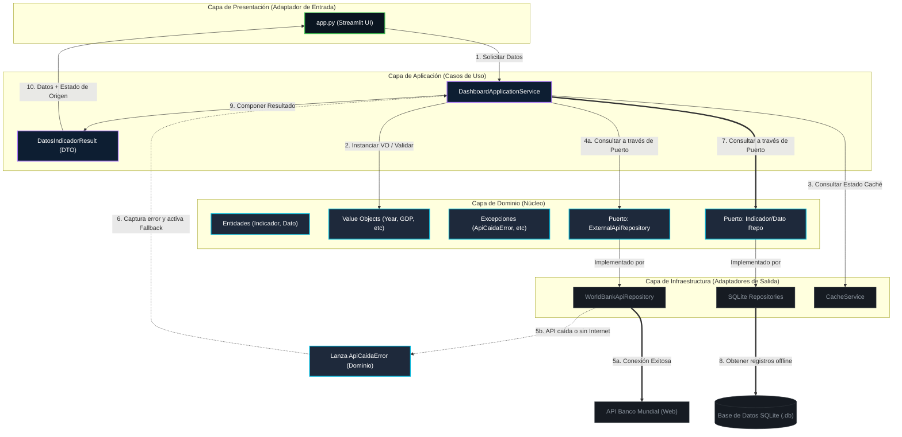

# Dashboard Socioeconómico de Nicaragua (Arquitectura Hexagonal)

Este proyecto implementa un dashboard interactivo en **Streamlit** para analizar indicadores clave de Nicaragua utilizando datos de la **API pública del Banco Mundial**. El sistema está diseñado siguiendo los principios de la **Arquitectura Hexagonal (Ports & Adapters)** para garantizar un desacoplamiento completo entre la lógica del negocio (Dominio) y los detalles tecnológicos (Infraestructura / UI).

---

## Estructura de Capas del Proyecto

El proyecto está estructurado de la siguiente forma:

```
├── domain/                  # Capa de Dominio (Reglas de negocio y entidades puras)
│   ├── entities.py          # Entidades (IndicadorEconomico, DatoHistorico)
│   ├── value_objects.py     # Objetos de Valor (Year, GDP, Percentage, etc.)
│   ├── exceptions.py        # Excepciones propias del negocio
│   └── repositories.py      # Puertos (Interfaces/ABCs para almacenamiento y API)
│
├── application/             # Capa de Aplicación (Casos de uso y orquestación)
│   └── services.py          # DashboardApplicationService (Orquestador principal y DI)
│
├── infrastructure/          # Capa de Infraestructura (Adaptadores concretos de salida)
│   ├── database/            # Conexión SQLite y migraciones versionadas
│   ├── repositories/        # Implementaciones de SQLite y WorldBank API
│   └── cache/               # Servicio de control de expiración de caché técnica
│
├── presentation/            # Capa de Presentación (Adaptador de entrada / Interfaz)
│   ├── ui_adapter.py        # Adaptador para formatear y mapear datos en la UI
│   └── app.py               # Dashboard en Streamlit
│
└── tests/                   # Pruebas unitarias y de integración
```

---

## Diagrama de la Arquitectura (Bonus)

El siguiente diagrama detalla cómo interactúan los componentes en la Arquitectura Hexagonal y describe el **Flujo de Ejecución Normal** y el **Flujo de Fallback (Offline)**.



---

## Mecanismo de Fallback y Modo Offline

1. **Intento de Consulta en Red (Flujo Normal)**:
   Al solicitar un indicador, el servicio `DashboardApplicationService` intenta conectarse al puerto `ExternalApiRepository` (implementado por `WorldBankApiRepository`) para descargar los datos actualizados.
2. **Registro en Caché**:
   Si la conexión tiene éxito, los datos se validan contra los Value Objects del dominio (verificando rangos de años y validez de PIB o porcentajes) y se persisten en la base de datos SQLite a través de `SQLiteDatoHistoricoRepository`. Además, se actualizan los metadatos en `CacheService`.
3. **Activación de Fallback (Modo Offline)**:
   Si la API del Banco Mundial no responde (por caída de red, timeout o errores HTTP), el adaptador de infraestructura atrapa el error de red y eleva una excepción limpia del dominio (`ApiCaidaError`). El servicio de aplicación captura esta excepción y realiza un **fallback transparente** recuperando los datos directamente del adaptador de base de datos SQLite local.
4. **Respuesta al Usuario**:
   El servicio retorna los datos junto con un indicador `fuente_efectiva` ("API" o "Base de Datos Local (Offline)"). La UI recibe esta información y, de forma transparente, renderiza los datos mostrando un mensaje amistoso de aviso en el panel lateral si el sistema está operando en modo offline.
